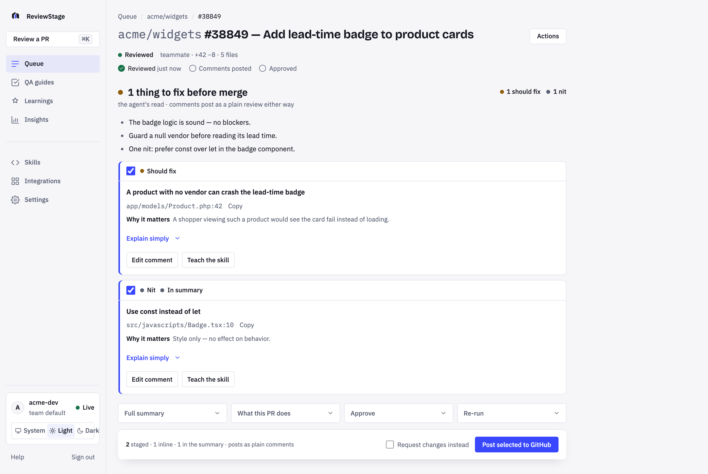

<p align="center">
  <a href="https://github.com/Wimukti/reviewstage/actions/workflows/ci.yml"></a>
  <a href="LICENSE"></a>
  <a href="https://wimukti.github.io/reviewstage/"></a>
</p>

<p align="center">
  
</p>

<h1 align="center">ReviewStage</h1>

<p align="center"><strong>Stage your PR review. Post it as yourself.</strong></p>

<p align="center">
  <a href="https://wimukti.github.io/reviewstage/">Website</a> ·
  <a href="https://wimukti.github.io/reviewstage/start/">Docs</a> ·
  <a href="https://wimukti.github.io/reviewstage/start/install/">Install</a> ·
  <a href="https://wimukti.github.io/reviewstage/developers/contributing/">Contributing</a> ·
  <a href="https://wimukti.github.io/reviewstage/security/">Security</a>
</p>

<picture>
  <source media="(prefers-color-scheme: dark)" srcset="website/src/assets/screenshots/hero-dark.png">
  
</picture>

> [!NOTE]
> ReviewStage is beta software. The gate — nothing reaches GitHub without a signed-in person clicking, under their own name — has been stable since the first version. The install, the UI and the configuration keys are still moving. Pin a tag if you deploy it for a team.

ReviewStage is an open-source, self-hosted PR review assistant built on [Claude Code](https://docs.anthropic.com/en/docs/claude-code). It drafts your review from the real diff, on your own Claude plan, and stages every finding privately in a dashboard. You tick the ones worth posting, edit any of them, and post them as a plain `COMMENT` review under your own GitHub account. Approval is a separate click. Nothing posts until you click.

## Quick start

```bash
git clone https://github.com/Wimukti/reviewstage && cd reviewstage
cp .env.example .env               # set REPOS and GITHUB_PAT (the service token)
docker compose up -d
bin/doctor.sh                      # diagnostics — re-execs inside the container
                                   # (or: docker compose exec app doctor)
                                   # (RS_HOST_PORT=9000 in .env moves the host port)
```

You need Docker with Compose v2 and a host with **at least 2 GB of RAM** — a review refuses to
start below `MIN_FREE_MB` (800 MB *available*), so a 1 GB VPS cannot run one. `GITHUB_PAT` is a
fine-grained service token on the repositories in `REPOS` with **Pull requests: Read and
write**, **Contents: Read** and **Metadata: Read**. It reads PR metadata and diffs, clones the
repositories and runs the poller's searches; nothing in the review or service path ever writes
to GitHub with it — every comment and approval uses the acting reviewer's own token. You also
need about **500 MB free** on the data volume (`MIN_FREE_DISK_MB`); a job refuses to start below
it rather than producing an empty review.

Before you point it at anyone else's pull request, read the
[security model](https://wimukti.github.io/reviewstage/security/): what is stored, what each
token can do, and what is deliberately not defended against.

Open **http://localhost:8899**, click **Sign in with GitHub** (works out of the box: GitHub's device flow with a shared public client ID — enter a short code at github.com/login/device, nothing to register; a fine-grained token also works), connect your Claude account, and paste a PR URL. Teams that want one-click redirect sign-in under their own app identity can still register an OAuth App (`GH_CLIENT_ID` / `GH_CLIENT_SECRET`). `DRY_RUN=1` is on by default: everything works except the final write to GitHub, so you can compare the output with your own reviews before letting it carry your name. Full walk-through: [Your first review](https://wimukti.github.io/reviewstage/start/first-review/).

## Why not an auto-review bot?

**Bots get ignored.** A comment from a bot account is one more notification to scroll past, and on a busy repository it is the first thing people learn to filter. A comment from a colleague, in their words, gets read and answered. ReviewStage produces the second kind.

**Accountability has to sit with a person.** A wrong nit costs a reply; a wrong approval ships a bug. So ReviewStage never requests changes, never blocks a merge, and never approves on its own. The agent's verdict is shown to you as an assessment. Posting and approving are two different buttons, and the agent can press neither: the script that runs the review has no GitHub write path at all.

**It runs on your plan, so it runs when you click.** Each reviewer connects their own Claude account in the browser; a review is a real agent run against a real diff — a few minutes for a typical PR on Opus, longer for Deep — billed to whoever started it. That is why it is click-to-run rather than on every push, and why the run form asks for an effort level before it starts.

## Highlights

- **A staging area, not a comment stream.** Tick and untick findings, edit inline with a preview, attach GitHub suggestion blocks, ask for a plain-words explanation with how to verify. Re-run at another effort or focus; every earlier run is kept.
- **Per-reviewer identity.** Posts and approvals go out under each person's own token. The server's own service token is only ever read from — and the review agent runs with every GitHub credential stripped from its environment, an explicit tool deny list, and a before/after count of the PR's reviews, comments and threads that fails the run if anything landed. A prompt-injected write attempt is a failed run, not a comment under your name. [What that does not cover](https://wimukti.github.io/reviewstage/security/#prompt-injection-from-hostile-diffs).
- **Effort, focus and model per run.** Quick, Standard or Deep (auto-suggested from the diff), a free-text focus note, and your plan's default model or Opus, Sonnet or Haiku. Tokens and model are shown per run.
- **Profiles your repo once and makes every review walk its critical paths.** Deterministic signals (tree, churn, in-degree, CODEOWNERS, CI) plus one Sonnet call name the paths where a mistake hurts most, and every generated path is checked against the tree before it is kept. Standard and Deep reviews that touch one are told to verify callers, contracts, migrations and tests, and findings on it carry a badge. Editable in the dashboard; optional automatic re-profile when the tree changes.
- **It learns what your team drops — and hardens it into rules.** Kept, reworded and dropped findings feed the next review of the repository, recorded once after the post actually reaches GitHub and keyed so a retry replaces rather than doubles. Drop the same complaint three times across different PRs and ReviewStage drafts it as a proposed team rule, with the evidence attached, for you to accept or dismiss with one click — nothing reaches a skill on its own. Skills are scored by how often their findings survive a human; the team default is versioned in a git repository on your server, with a revision history; add a rule in plain words.
- **Independent reviews, weighted agreement.** Two reviewers on one PR get separate runs in separate worktrees; findings both raised with a different skill, model or effort are marked confirmed.
- **One install, many repositories.** List them in `REPOS` or accept a whole org with `REPO_ALLOW_ORG`; per-repo skills and risk paths, a repo chip and filter on every queue row, Insights across repositories.
- **From PR to QA guide.** A tester-ready P0/P1/P2 test plan built from the same diff and review threads.
- **Slack, Discord or any webhook.** Cards for review requested, review ready, stopped and QA ready — Slack (webhook or threaded bot token), Discord embeds, or a signed JSON POST to Teams, Zapier, n8n or your own endpoint. Or none: the dashboard is the inbox. Switched live from the Settings page.
- **Post a second round.** Posting is scoped to the review run, not the pull request: review, post, the author pushes, review again, post again. The same run cannot post twice, and approval knows which commit you read — a moved branch needs an explicit confirmation.
- **Safe by construction.** Diff-anchor validation so GitHub does not reject a whole review over one line; every action HMAC-signed and short-lived; tokens encrypted at rest; the server refuses to start without a real `RS_SECRET`; `DRY_RUN` on by default.

## Solo · Team · Company

| | Solo | Team | Company |
| --- | --- | --- | --- |
| Runs on | Docker on your laptop | One server for the team | One install for the organisation |
| Sign-in | You, with a fine-grained token | Everyone, as themselves | Org allowlist; GitHub App sign-in is on the roadmap |
| Repositories | Many | Many | Many, with per-repo skills and risk paths |
| Notifications | None; paste a PR URL | Review-request alerts to Slack, Discord or any webhook | Same, per repository |
| Insights | Your own runs | The team's keep rate, agreement, cycle time | Across repositories |
| Billing | Your Claude plan | Each reviewer's own plan | Each reviewer's own plan |

Same gate at every size: nothing reaches GitHub without a signed-in person clicking, under their own name. Team and Company are configuration, not a different edition. On a phone, **Add to Home Screen** installs the dashboard as an app; the native wrapper and push notifications are described in [docs/MOBILE.md](docs/MOBILE.md).

## Team mode

```bash
docker compose --profile team up -d
```

Adds the review-request poller and notification cards: within three minutes of someone requesting your review, you get a card that mentions you and opens the PR page. One server serves the whole team — and **one install reviews many repositories**: list them in `REPOS`, or set `REPO_ALLOW_ORG` to accept any repo under your org where someone gets a review request. Each person signs in once with their own GitHub token and Claude account. Reviews are independent per reviewer; posting and approval are always per person. Cards go to Slack (incoming webhook or bot token with threaded replies), Discord, or any JSON webhook; the poller's interval and on/off switch live in the dashboard's Settings page. See [Team mode](https://wimukti.github.io/reviewstage/start/team-mode/).

## Documentation

- [What ReviewStage is](https://wimukti.github.io/reviewstage/start/) — the one-minute model
- [Install](https://wimukti.github.io/reviewstage/start/install/) — Docker Compose, or from source on a Linux server
- [Reviewing a PR](https://wimukti.github.io/reviewstage/guides/reviewing/) · [Skills and learnings](https://wimukti.github.io/reviewstage/guides/skills-and-learnings/) · [QA guides](https://wimukti.github.io/reviewstage/guides/qa-guide/) · [Notifications](https://wimukti.github.io/reviewstage/guides/notifications/) · [Insights](https://wimukti.github.io/reviewstage/guides/insights/)
- [Security model](https://wimukti.github.io/reviewstage/security/) — what is stored, token permissions, what is not defended against
- [Configuration](https://wimukti.github.io/reviewstage/operations/configuration/) · [Troubleshooting](https://wimukti.github.io/reviewstage/operations/troubleshooting/)
- [Architecture](https://wimukti.github.io/reviewstage/developers/architecture/) · [Contributing](https://wimukti.github.io/reviewstage/developers/contributing/) · [Roadmap](https://wimukti.github.io/reviewstage/developers/roadmap/)

The documents under [`docs/`](docs/) are the canonical prose the site is built from: [SETUP.md](docs/SETUP.md) (from source), [INSTALL-DOCKER.md](docs/INSTALL-DOCKER.md), [OPERATIONS.md](docs/OPERATIONS.md), [SECURITY.md](docs/SECURITY.md), [ARCHITECTURE.md](docs/ARCHITECTURE.md) and [MOBILE.md](docs/MOBILE.md).

## Develop from source

The backend is Python's standard library plus bash, `gh`, `jq`, `git`, `openssl` and the Claude Code CLI. No database; state is files.

```bash
# dashboard (React 19 + TypeScript, esbuild)
cd dashboard-ui && pnpm install && pnpm test && pnpm build
pnpm exec playwright install chromium   # once, then:
pnpm test:browser                       # Playwright against the offline fixture

# shell and python have no unit suite; keep them compiling
bash -n bin/*.sh && python3 -m py_compile bin/*.py

# website (Astro + Starlight)
cd website && pnpm install && pnpm build && pnpm check
```

To run the server outside Docker on a Linux box, `bin/bootstrap.sh` installs the pieces idempotently into `~/.reviewstage/` as the `reviewstage.service` systemd unit; see [Install → From source](https://wimukti.github.io/reviewstage/start/install/#from-source-on-a-linux-server).

## Contributing, security, and license

Contributions are welcome; read [Contributing](https://wimukti.github.io/reviewstage/developers/contributing/) first. The one rule that is not negotiable: nothing may add a GitHub write path to the review step or post under an identity other than the signed-in user's.

For a security problem, use GitHub's private vulnerability reporting on this repository rather than a public issue. The threat model, including what is deliberately not defended against, is in [Security](https://wimukti.github.io/reviewstage/security/).

MIT licensed. See [LICENSE](LICENSE).

## Acknowledgements

Built on [Claude Code](https://docs.anthropic.com/en/docs/claude-code) by Anthropic: the review runs the genuine CLI headless, and connecting your account uses its own `claude setup-token` flow. ReviewStage is not affiliated with Anthropic or GitHub.
