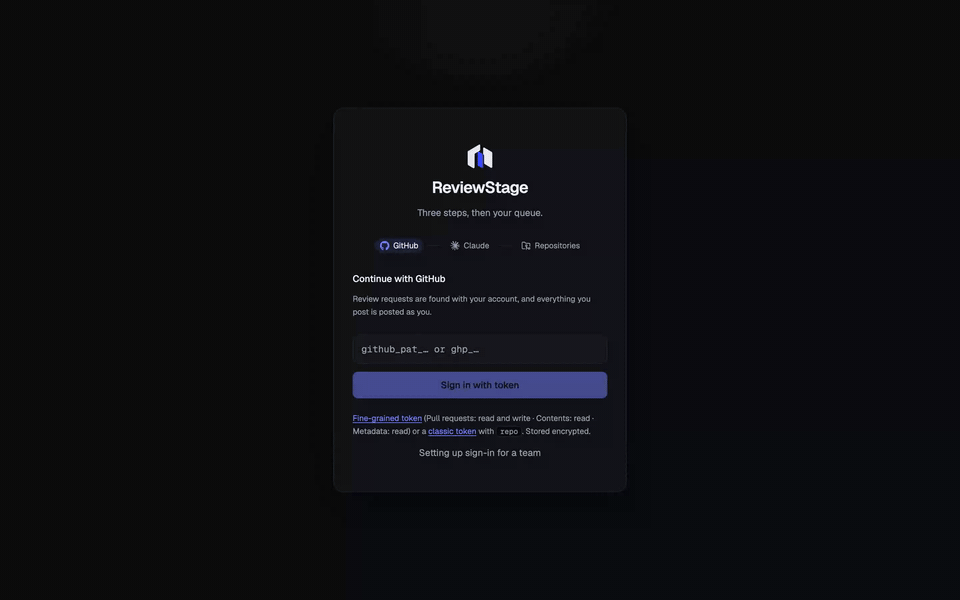
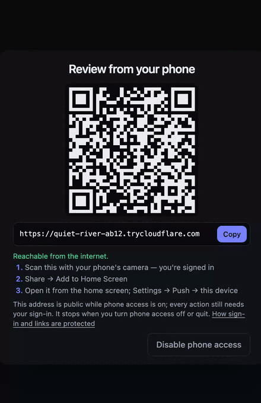

# Install: the desktop app (`npx reviewstage`)

The one-person install. One command on a laptop, your phone over a QR code, no Docker, no `.env`
to edit, no service token. The team install — one server, every reviewer signed in as
themselves — is [INSTALL-DOCKER.md](INSTALL-DOCKER.md).

```bash
npx reviewstage
```



## What you need

| | Why |
| --- | --- |
| **Node 20+** | `npx` fetches the package and the Electron runtime with it. If you installed Claude Code with npm, you have it. |
| **Claude Code** on PATH (`npm install -g @anthropic-ai/claude-code`) | Reviews run on *your* Claude account through Claude Code. The app never fetches it for you; that is a deliberate line, not an omission. |
| **Git, Python 3, Bash, OpenSSL, curl** | The server is Python's standard library and bash. Every macOS has them after `xcode-select --install`; every Linux desktop has them. |
| **macOS 12+ (Apple Silicon or Intel) or Linux x64/arm64** | Windows is a follow-up (the job scripts are bash; a WSL path is the likely shape). |

There is no Gatekeeper warning. The app is Electron installed by npm — a Node package, not a
downloaded `.app` — which is exactly how `npx @nervekit/desktop` and other npm-distributed
desktop apps run, and why no Apple Developer account is involved.

## What happens on first launch

1. **Review tools.** The server's scripts need `gh` and `jq`, and `flock`, which macOS lacks.
   Whatever the machine does not have is fetched once from the tool's own GitHub release,
   **pinned by version and SHA-256** in the package's `tools.json`, into `~/.reviewstage/bin`.
   A checksum mismatch stops the install; it is never skipped. `flock` is a small Python shim
   covering the three call shapes the scripts use.
   On macOS the Electron bundle npm installed is renamed and re-iconed once (`ReviewStage` in
   the Dock and the app switcher, the app's own mark) and ad-hoc re-signed with the system
   `codesign`, as Electron's npm build already is; if any of that fails, the app runs under
   Electron's own name and icon.
2. **Claude Code** is looked for on PATH. Missing → the window says so and how to install it.
3. **Server.** A free loopback port is chosen; `~/.reviewstage/.env` is written on the first run
   with a random `RS_SECRET`, `RS_PERSONAL=1`, `GH_DEVICE_FLOW=1` and `DRY_RUN=0`; the bundled
   server starts and the window loads once `/health` answers.
4. **Three steps.** *Continue with GitHub* (device flow: a short code at
   github.com/login/device, or paste a fine-grained token), *Connect Claude* (the same
   `claude setup-token` flow as the team install, skippable for now), *Pick repositories* (a
   searchable list of the repositories you own, collaborate on or belong to through an
   organisation; up to 50). Then your queue.

From then on the app polls GitHub itself for review requests on the repositories you picked,
with your own signed-in token (kept encrypted at rest; never in `.env`). The dock badge shows
the count; a system notification fires when it rises.

## Repositories and accounts

- **Repositories** in the sidebar (also the first card on Settings, and `/repos`) lists the
  repositories you own, collaborate on or belong to through an organisation. Tick or untick and
  save; the queue filter and the badge follow at once, no restart.
- **Switch GitHub account** is in the account ⋯ menu at the foot of the sidebar, above
  **Sign out**. It signs you out and opens the sign-in step again. Posts stay under the account
  that made them.

## Personal mode, precisely

`RS_PERSONAL=1` is what makes a single-user install possible without a service token:

- the server **boots with zero repositories** (team mode refuses, as before) and reads the
  configured set as the union of `REPOS` in `.env` and `settings.json["repos"]`, which the wizard
  writes;
- an **in-process poller** replaces the `pr-watch` service: the same search, the same queue rows,
  the same notification cards, run with each signed-in user's token;
- the job scripts receive that token **in the process environment only** (`GITHUB_PAT`,
  `REVIEWER`, and the wizard's repositories as `RS_REPOS_EXTRA`); nothing is written to disk;
- the five design properties are unchanged: the review step still has no GitHub write path,
  every post uses the clicker's own token, click-to-run only, on the clicker's Claude account,
  reviewers independent.

## Your phone

**ReviewStage → Enable phone access…** (also in the Dock menu) starts a
[Cloudflare quick tunnel](https://developers.cloudflare.com/cloudflare-one/connections/connect-networks/do-more-with-tunnels/trycloudflare/)
to the local server and shows a QR code, with the `https://….trycloudflare.com` address under
it. On the phone:

1. **Scan the code with the camera.** The phone is signed in as the person signed in on the
   Mac — no second GitHub login. The QR carries a single-use code valid for 30 minutes; if it
   has expired the login page says so and **Show phone access code…** on the Mac mints a new one.
2. Share → **Add to Home Screen**.
3. Open it from the home screen; **Settings → Push → This device**.



A review request on a watched repository notifies the phone; the dashboard is the same app at
phone width. Not signed in on the Mac yet? The QR then carries the plain address and the window
says to sign in on the Mac first.

**How long the tunnel lasts.** As long as the app runs. `cloudflared` reconnects by itself after
a dropped connection or sleep, and the address stays the same. Quitting the app ends it; the
next **Enable phone access…** gets a new address, so scan again (a quick tunnel cannot keep a
name; a named tunnel needs a Cloudflare account and is on the roadmap). If `cloudflared` crashes
while phone access is on, the app restarts it once with a new address, mints a new code and
shows a notification, "Phone address changed — rescan the code"; a second crash within 5 minutes
stops it, the menu shows phone access as disabled and the phone window says why.

What to know: the address is public while the tunnel is up — anyone who has it reaches your
sign-in page and nothing more (every API call needs the session cookie; pair codes are
single-use; action links are HMAC-signed and short-lived). **Disable phone access**, or
quitting the app, closes the tunnel. `cloudflared` is fetched like the other tools, pinned by
checksum.

## Where things live

```
~/.reviewstage/
  .env            written by the app; RS_SECRET, RS_PERSONAL=1, DRY_RUN=0, PUBLIC_URL=http://127.0.0.1:<port>
  settings.json   repositories (wizard or the Repositories page), poller interval, notifier settings
  bin/            gh, jq, cloudflared, flock (fetched or shimmed), with .<tool>.version stamps
  state/          every run: staged findings, posted-review records, learnings
  repos/          one blobless clone per repository
  users.json      who signed in; tokens encrypted with RS_SECRET
  server.log      the server's output from the last launch
```

Delete the directory to start over. Posting is live from the first run: in the desktop app the
Post button is the gate, and nothing reaches GitHub until you press it (the team install keeps
`DRY_RUN=1` so a shared server's output can be compared before it carries anyone's name). To
rehearse without posting, add `DRY_RUN=1` to `.env` and relaunch.

## Diagnostics

```bash
npx reviewstage --doctor
```

runs the server's own `doctor.sh` against this install — the fetched tools on PATH, the port the
app chose — and prints one PASS / WARN / FAIL line per check without opening a window. In
personal mode a missing `REPOS` is a WARN, not a FAIL, and `GITHUB_PAT` is not expected.

## Updating

`npx reviewstage` resolves `latest` each time it is run from a cold cache; `npx reviewstage@latest`
forces it. Your data in `~/.reviewstage` is untouched by an update. Pre-releases are published
too, under the same tag, while the project is in beta.

## Linux note

Chromium's setuid sandbox helper must be root-owned with mode 4755; a binary npm installed into
your home directory cannot be, and Ubuntu 24.04 also restricts the unprivileged-namespace
fallback, so an npm-installed Electron app aborts at launch. The launcher checks the helper and,
where it is unusable, starts the window with `--no-sandbox`. The window only ever shows the
local server — external links open in your browser — so the renderer sandbox is not guarding
third-party content here. If you prefer it on, make the helper setuid once:
`sudo chown root:root …/electron/dist/chrome-sandbox && sudo chmod 4755 …/chrome-sandbox`
(the path is printed in the error you would otherwise see).

## Not yet

- **Windows.** The server's job scripts are bash; a WSL-hosted server with the Electron shell on
  Windows is the planned shape. Until then, use the Docker install under WSL2.
- **Auto-update inside the running app.** Relaunch with `npx reviewstage@latest`.
- **A signed `.dmg`.** Not planned while the npm path works without one.
